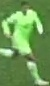
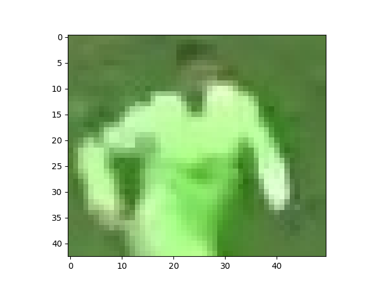
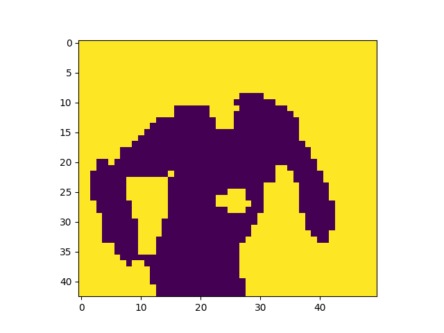
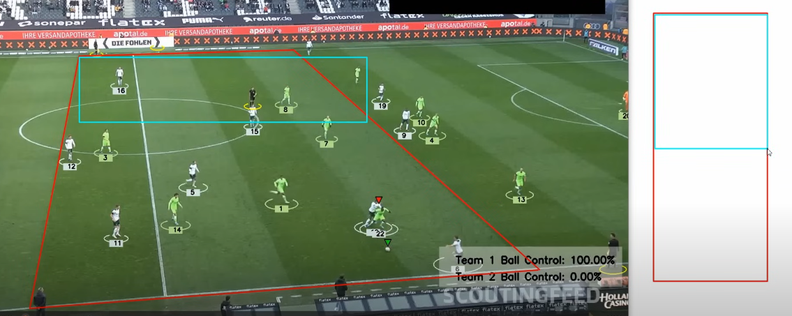

# Football Analysis

Output video in /output folder

https://github.com/user-attachments/assets/d8b6499d-11fa-4a84-8122-71b5cee524d8

 

Features
------
* Detects player, ball and referees.
* Detects player in possesion of ball.
* Display team ball control.
* Display Camera motion.
* Predicts player position
* Display player id, speed and distance.
 

Methodology
------
Preparing Data
* Fine-tuning model of YOLOv8 model on roboflow dataset of  precisely predicts detects and tracks players, ball and  referees.
* Pickle file is used for storing dictionary, for faster load later on.

Tracking Data
* By using K-means clustering, predicts team color and assign to players.

 
  
  
  

* Tracks active player using player & ball distance.
* Uses data interpolation, for smoother ball tracking.

Optical Flow
* Using cv2 optical flow, camera movement is measured.
* View transformation is obtained by manual marking first frame field points to the point it represent in standard field (105m x 68m).
* For player position, camera movement speed is added to player pixel position then view transformation is applied.
* On comparing player position in past batch of frames, player speed and distance travelled is obtained.

 
  

 
Model Used : YOLOv8 
Dataset Used : football player detection Image dataset (612 Images) 
Fine-tuned model: <a href ="https://huggingface.co/Ayushkm10/Football_video_analyser/blob/main/best.pt">Huggingface link</a>

Tools used
------
* ultralytics YOLOv8
* roboflow dataset
* supervision
* sklearn K-Means
* OpenCV 
* pandas
* numpy, matplotlib

Limitations
-------
* Can be better in predicting goalkeeper and referees.
* On overlapping of ball and player may predicts wrong active player.
* Attach new id to player on leaving and re-entering frame.

Future works
-------
* Add player position in rectangle HUD of field.
* Add function to predict goalkeeper by rejection and side of field.
* Better representation of data.

Acknowledgement
-------
* The tutorial following in building this project -   
https://www.youtube.com/watch?v=7l5UgtWfnw0
* Roboflow
* Ultralytics
